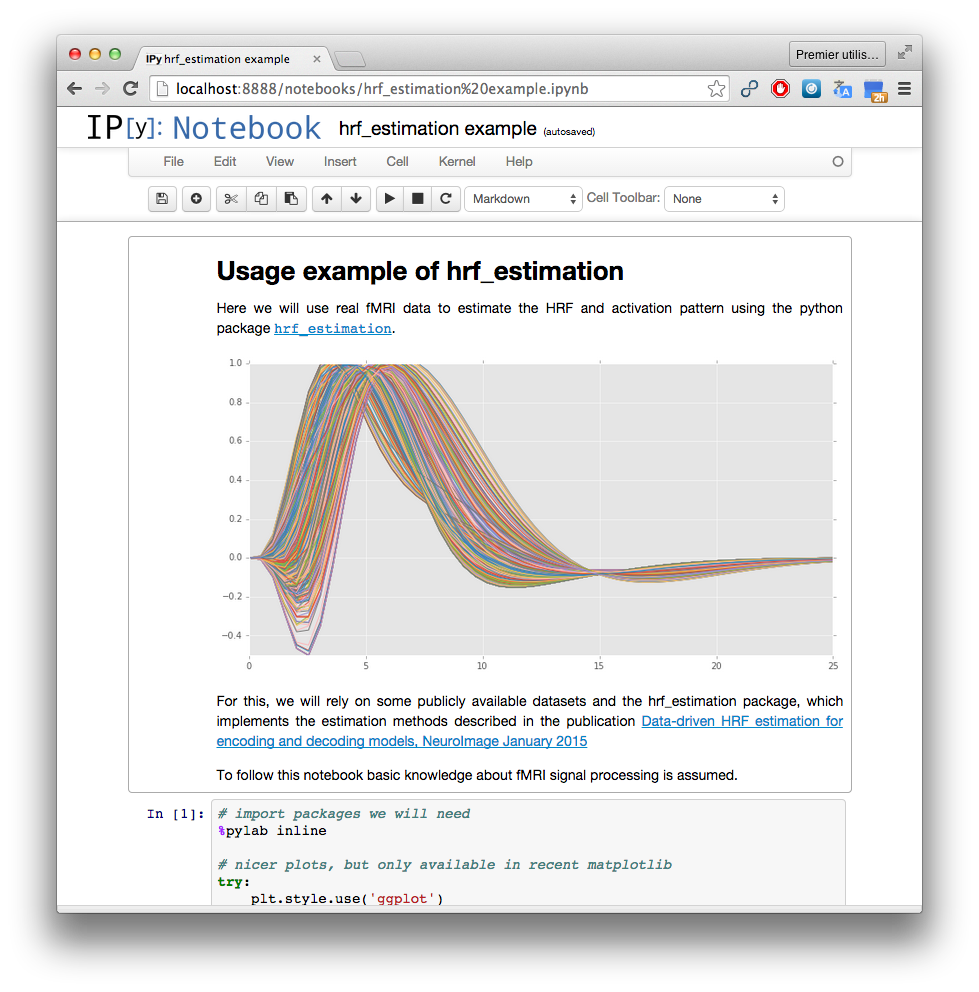

This package implements method for the joint estimation of hemodynamic response function (HRF) and activation coefficients (aka beta-maps) from fMRI data. The methods implemented here are described in the paper

`Data-driven HRF estimation for encoding and decoding models <http://hal.inria.fr/hal-00952554/en>`_, Pedregosa et al. 2004

Examples
========

The following `ipython notebook <http://nbviewer.ipython.org/github/fabianp/hrf_estimation/blob/master/examples/hrf_estimation%20example.ipynb>`_ shows a complete example of how to use the function :func:`hrf_estimation.glm` to estimate the HRF and activation coefficients from a giveb BOLD signal.

Main functions
==============

The main function in the package is called :func:`hrf_estimation.glm` and will extract the HRF and activation coefficients from BOLD signal. 

This function takes as input a vector of conditions, a vector of onsets, the TR (float) and the matrix of BOLD measurements (of size n_timecourse * n_voxels). The return values of `hrf_estimation.glm` are the estimated HRF, the activation coefficients (a.k.a beta-maps). Note that the estimated HRFs are given as the coefficients in the basis of choice. To obtain the full HRF you must multiply by the basis (the example below shows an example of this)

The function :func:`hrf_estimation.glm` is meant to be used whenever the conditions and onsets are available. It will compute internally the design matrix without the possibility to modify it.

However, if you have already formed the design matrix and only want to estimate a R1-GLM model from that design matrix and a matrix fo BOLD measurements, then the function :func:`hrf_estimation.rank_one` can be used.

Other functions
===============

The package contains other routines for convenience. For example, the module :mod:`hrf_estimation.hrf` contains several models for the HRF (such as the SPM HRF in :func:`hrf_estimation.hrf.spmt` and its time derivative :func:`hrf_estimation.hrf.dspmt` and its dispersion derivative :func:`hrf_estimation.hrf.ddspmt`).

The module :mod:`hrf_estimation.savitzky_golay` contains the savgol filter :func:`hrf_estimation.savitzky_golay.savgol_filter` for detrending backported from SciPy.

Frequently Asked Questions
==========================

Q: What parameters to use when detrending using the savgol filter?

A: It depends on the data, we have found that the parameters detailed in the paper Çukur et al. “Attention during natural vision warps semantic representation across the human brain.,” work well in practice. They used a window length of 240 seconds and a cubic order polynomial.

API reference
=============

.. toctree::

	reference

Indices and tables
==================

* :ref:`genindex`
* :ref:`modindex`
* :ref:`search`

